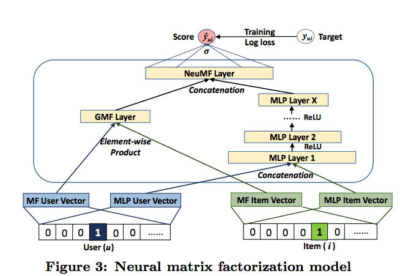

# Neural Collaborative Filtering (NeuMF)

Implementation of Neural Collaborative Filtering (NeuMF) in Pytorch. NeuMF is presented in the paper, [Neural Collaborative Filtering](https://arxiv.org/abs/1708.05031).
<div></div>

# Usage
```
python run.py [-h] [-s SEED] FILE

positional arguments:
  FILE                  path to config file

options:
  -h, --help            show this help message and exit
  -s SEED, --seed SEED  seed for initializing training
```

# Example
```
python run.py examples/ml-1m/config.toml

```
